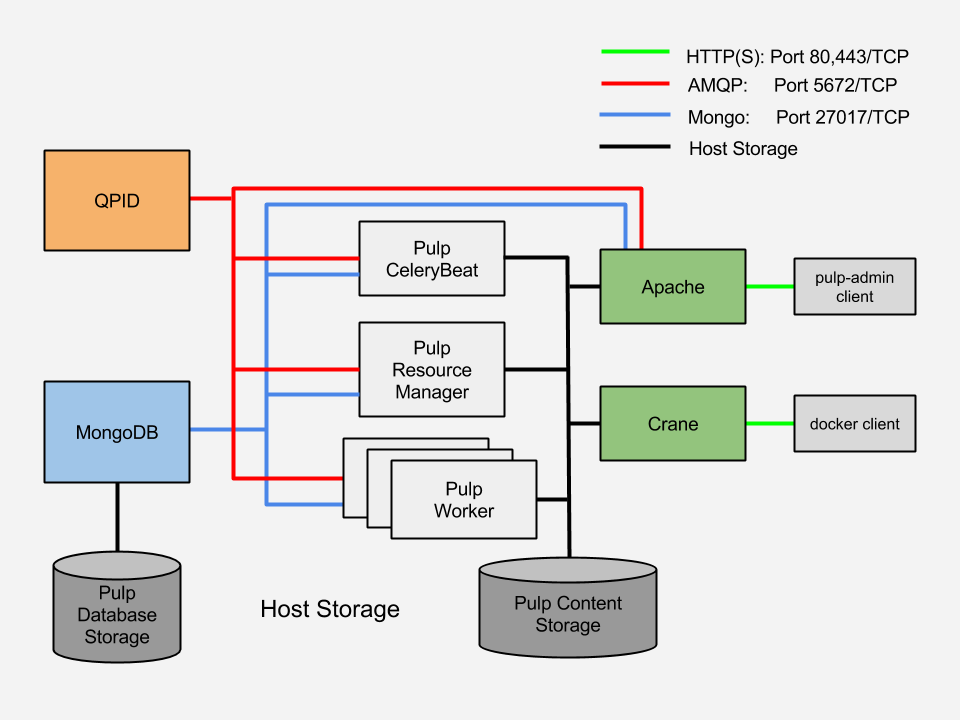

# Pulp Dockerfiles

This is the directory for pulp Docker packaging. See the [Pulp Docker Registry quickstart guide](docker-quickstart.rst) for deploying Pulp as a multi-container environment and using Pulp as a docker registry.

`registry_admin.py`: docker-focused pulp registry client prototype. Requirements:
* access to Pulp server version 2.5 or greater with pulp_docker plugin enabled to support docker content type
* running docker service
* Python 2.7 or greater

## Pulp Component Architecture

